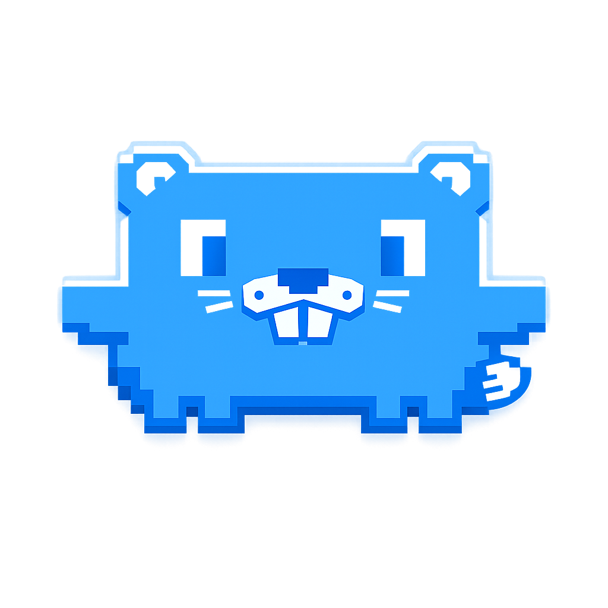
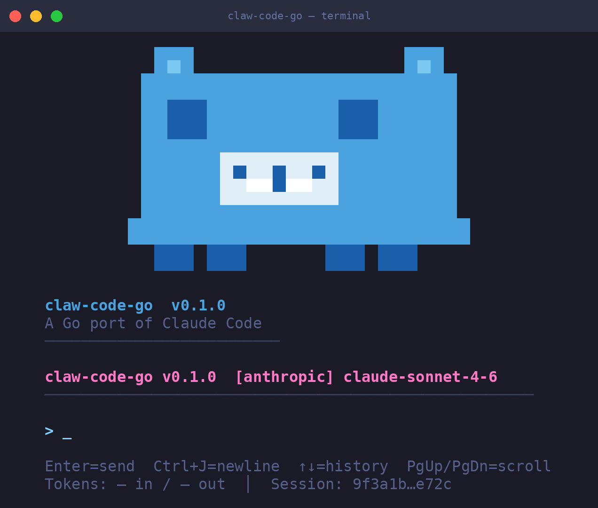

# claw-code-go

<p align="center">
  
</p>

<p align="center">
  <strong>A Go port of Claude Code — Anthropic's agentic CLI coding assistant</strong><br/>
  Fast. Extensible. Built for terminals.
</p>

<p align="center">
  
  
  
  
  
</p>

---

<p align="center">
  
</p>

---

## What is this?

`claw-code-go` is a full Go reimplementation of [Claude Code](https://docs.anthropic.com/en/docs/claude-code) — Anthropic's agentic coding assistant. It runs in your terminal, understands your codebase, calls tools, writes and edits files, searches the web, and works autonomously until the job is done.

**Why Go?**
- Single static binary — no Node.js runtime required
- Faster startup, lower memory footprint
- Easier to embed, cross-compile, and distribute

---

## Features

### 🤖 Agentic Loop
Full tool-use conversation loop: Claude reasons, calls tools, reads the results, and keeps going until the task is complete or it hits an `end_turn`.

### 🎨 Bubble Tea TUI
Rich terminal UI built with [Bubble Tea](https://github.com/charmbracelet/bubbletea) — streaming output with a spinner, styled message history, syntax-aware theming, and a clean session view.

### 🛠 Tool Suite

| Tool | Description |
|------|-------------|
| `bash` | Execute shell commands (30s timeout, sandboxed) |
| `read_file` | Read files from disk |
| `write_file` | Write/create files |
| `file_edit` | Surgical text replacements in existing files |
| `glob` | Find files matching a glob pattern |
| `grep` | Search across files with regex |
| `web_fetch` | Fetch and parse a URL |
| `web_search` | Search the web (Brave API) |
| `todo_write` | Track and persist task lists |

### 🔐 OAuth + Multi-Provider Auth
Native OAuth flow for Anthropic accounts. Credentials are stored securely and refreshed automatically. OpenAI is scaffolded alongside Anthropic — swap providers via config.

### 🌐 MCP — Model Context Protocol
Full MCP integration: connect external tool servers over stdio or SSE, register their tools, and let Claude call them seamlessly alongside built-in tools.

### 🔒 Permissions & Safety
Fine-grained permission system controls what Claude can do — bash execution, file writes, network access — with configurable modes (`auto`, `ask`, `deny`) and rule-based overrides.

### 📦 Context Assembly
On every turn, claw-code-go automatically injects:
- Git repo state (branch, diff summary, recent commits)
- Memory directory files (`.claw-code/memory/`)
- System info (OS, hostname, working directory)

### 💾 Session Persistence & History
Sessions are saved as JSON files in `~/.claw-code/sessions/`. Resume any previous session by ID. The TUI includes a built-in session history browser.

### 📊 Token Usage & Cost Tracking
Every session tracks input/output tokens per turn. Estimated USD cost is shown at the end of each session for all known models (Claude 3/4 + GPT-4o family).

### ⚡ Context Compaction
Automatic conversation compaction keeps context windows manageable on long sessions — summarising older turns without losing important state.

### 🧠 Memory Directory
Drop markdown files into `.claw-code/memory/` and they're injected into every conversation automatically — persistent instructions, project context, preferences.

---

## Web UI

claw-code-go ships a production-ready, mobile-friendly web UI that runs
alongside the terminal mode. Start it with the `web` subcommand:

### Quick start

```sh
# Start the web server (opens the chat UI at http://127.0.0.1:7777)
./claw-code-go web --addr 0.0.0.0:7777

# With basic auth (protects all routes except /healthz)
CLAW_WEB_AUTH=user:pass ./claw-code-go web --addr 0.0.0.0:7777

# With bearer token (accepts ?token=... query param for browser bookmarking)
CLAW_WEB_TOKEN=my-secret-token ./claw-code-go web --addr 0.0.0.0:7777
```

### What you get

- **Chat UI** (`/`) — A mobile-first chat interface with streaming
  responses, tool-call cards, permission prompts, slash commands, and
  a session history sidebar. Works on a 375px-wide viewport with touch
  input and gracefully scales up to desktop.

- **Terminal mode** (`/terminal`) — The full Bubble Tea TUI streamed
  to the browser via wterm (Zig/WASM terminal emulator). For power
  users who prefer the terminal experience.

- **Structured API** (`/api/chat/ws`) — A WebSocket endpoint that
  streams structured `TurnEvent` JSON (text deltas, tool calls,
  permissions, usage) for custom frontends. See
  [docs/web-protocol.md](docs/web-protocol.md) for the wire format.

- **PWA installable** — Add the chat UI to your home screen on
  Android Chrome, iOS Safari, or desktop Chrome. Includes a service
  worker for offline fallback, a web app manifest, and an iOS
  "Add to Home Screen" instruction banner.

- **Observability** — Structured JSON logs via `log/slog`, Prometheus
  metrics at `/metrics`, health checks at `/healthz` and `/readyz`,
  and a friendly error page at `/error`.

- **Security** — HTTP Basic Auth (`CLAW_WEB_AUTH`), bearer token auth
  (`CLAW_WEB_TOKEN`), Content-Security-Policy headers, rate limiting
  (`CLAW_WEB_RATE_RPM`), and per-IP token buckets.

### Auth configuration

| Variable | Description |
|---|---|
| `CLAW_WEB_AUTH` | `user:pass` for HTTP Basic Auth on all protected routes |
| `CLAW_WEB_AUTH_FILE` | Path to a file containing `user:pass` |
| `CLAW_WEB_TOKEN` | Bearer token accepted via `Authorization: Bearer <token>` or `?token=<token>` query param |
| `CLAW_WEB_RATE_RPM` | Max messages per minute per IP (default: 60) |

### Production deployment

Place the web server behind Caddy or nginx for TLS termination. Full
configs (Caddyfile, nginx site config, systemd unit, firewall rules) are
in [docs/web-deployment.md](docs/web-deployment.md). A quick Caddy
example:

```caddyfile
chat.example.com {
    reverse_proxy localhost:7777
}
```

### Architecture

```
Browser (chat UI) ──WebSocket──> /api/chat/ws ──ConversationLoop──> AI Provider
                                                                     (Anthropic / OpenAI)
Browser (terminal)──WebSocket──> /ws ──PTY──> claw-code-go --repl
```

- **Chat mode** (`/api/chat/ws`): The browser sends `user_input` JSON
  messages; the server runs the `ConversationLoop` and streams back
  `text_delta`, `tool_start`, `tool_done`, `permission_ask`, `usage`,
  and `done` events as structured JSON. Use this for custom frontends.

- **PTY/Terminal mode** (`/ws`): A PTY runs the full Bubble Tea TUI.
  Raw bytes stream to the wterm emulator in the browser. Use this
  when you need the full terminal experience or want to keep using
  the TUI remotely.

Both modes share the same auth, provider, and model resolution. The
default landing page (`/`) is the chat UI. The terminal is available
at `/terminal` for power users.

### Mobile install

1. Open the chat UI in Chrome (Android or desktop) or Safari (iOS).
2. **Android/Desktop Chrome**: tap the install icon in the address bar
   or the three-dot menu → "Add to Home screen".
3. **iOS Safari**: tap Share → "Add to Home Screen" (an instruction
   banner appears automatically on first visit).
4. The app opens in standalone mode (no browser chrome), works
   offline, and supports the soft keyboard correctly.

Full install verification steps are in
[docs/web-deployment.md#pwa-install-verification](docs/web-deployment.md#pwa-install-verification).

---

## Prerequisites

- **Go 1.24+**
- `ANTHROPIC_API_KEY` environment variable (or log in via `--login`)

---

## Install

```sh
git clone https://github.com/daolmedo/claw-code-go
cd claw-code-go
go build -o claw-code-go ./cmd/claw-code-go
```

Or install directly:

```sh
go install github.com/daolmedo/claw-code-go/cmd/claw-code-go@latest
```

---

## Usage

### Interactive REPL (default)

```sh
./claw-code-go
```

### One-shot mode

```sh
export ANTHROPIC_API_KEY=sk-ant-...
./claw-code-go --prompt "Refactor the auth package to use interfaces"
```

### Login — Anthropic (OAuth)

```sh
./claw-code-go --login
# or explicitly:
./claw-code-go --login --provider anthropic
```

### Login — OpenAI (API key)

```sh
./claw-code-go --login --provider openai
# Prompts for your OpenAI API key and stores it securely
```

Credentials are saved to `~/.claw-code/credentials/` and reused automatically on the next run. Switch providers at any time with `--provider`.

### Resume a session

```sh
./claw-code-go --session <session-id>
```

### Ralph loop (autonomous spec runner)

`claw ralph` runs a self-referential autonomous loop that reads a spec file
(default: `ROADMAP.md`), implements one item per iteration, and updates the
spec as work completes. Useful for overnight runs on a roadmap.

```sh
# Default: read ./ROADMAP.md, run up to 50 fresh-context iterations
./claw-code-go ralph

# Custom spec file, custom cap
./claw-code-go ralph --spec ./SPEC.md --max-iterations 100
```

How it works:
1. Each iteration starts with a fresh provider session (where supported).
2. The model reads the spec, picks the next unchecked item, implements it,
   marks it done in the spec, and commits.
3. The model signals completion by emitting the literal sentinel
   `RALPH_DONE` on its own line. The loop also exits automatically if every
   checkbox in the spec is marked done.
4. If the model hits a real blocker, it documents it under a `## Blockers`
   heading at the bottom of the spec — the next iteration reads that note.

The spec file is the only persistent state. Each iteration you will get a
fresh agent context. Write everything important to the spec.

---

## CLI Flags

| Flag | Default | Description |
|------|---------|-------------|
| `--prompt` | — | Single prompt (one-shot mode) |
| `--model` | `claude-sonnet-4-20250514` | Model to use |
| `--provider` | `anthropic` | AI provider: `anthropic`, `openai` |
| `--repl` | false | Force interactive REPL mode |
| `--login` | false | Authenticate for the selected provider |
| `--session` | — | Resume a saved session by ID |
| `--session-dir` | `~/.claw-code/sessions` | Directory for session files |
| `--permission-mode` | `ask` | Permission mode: `auto`, `ask`, `deny` |

---

## Slash Commands (REPL)

| Command | Description |
|---------|-------------|
| `/help` | Show available commands |
| `/clear` | Clear the current session |
| `/session-list` | Browse saved sessions |
| `/model <name>` | Switch model mid-session |
| `/compact` | Manually trigger context compaction |
| `/cost` | Show current session token usage and estimated cost |
| `/exit` or `/quit` | Exit the REPL |

---

## Environment Variables

| Variable | Description |
|----------|-------------|
| `ANTHROPIC_API_KEY` | Your Anthropic API key |
| `ANTHROPIC_MODEL` | Override the default model |
| `ANTHROPIC_BASE_URL` | Override the Anthropic API base URL |
| `OPENAI_API_KEY` | OpenAI API key (if using OpenAI provider) |

---

## Project Structure

```
claw-code-go/
├── cmd/claw-code-go/        # CLI entry point
└── internal/
    ├── api/                 # Anthropic API client (SSE streaming, types)
    ├── auth/                # OAuth flow, credential storage, token refresh
    ├── commands/            # Slash command registry
    ├── compat/              # Upstream TS source parity manifest
    ├── config/              # Config loading, permission modes, rules
    ├── context/             # Context assembly (git, memory, sysinfo)
    ├── mcp/                 # Model Context Protocol client (stdio + SSE)
    ├── permissions/         # Permission enforcement & rule engine
    ├── runtime/             # Agentic conversation loop, session persistence
    ├── tools/               # Built-in tool implementations
    ├── tui/                 # Bubble Tea TUI (model, styles, theme, history)
    └── usage/               # Token tracking and cost estimation
```

---

## Roadmap

- [x] Phase 1 — Foundation: API client, basic conversation loop, core tools
- [x] Phase 2 — TUI: Bubble Tea UI, streaming, spinner, slash commands
- [x] Phase 3 — OAuth + multi-provider scaffolding
- [x] Phase 4 — MCP (Model Context Protocol) integration
- [x] Phase 5 — Permissions & Safety
- [x] Phase 6 — Context compaction
- [x] Phase 7 — Multi-provider login UX
- [x] Phase 8 — Compat harness modes
- [x] Phase 9 — Full TUI foundation (themes, history view)
- [x] Phase 10 — Core tool expansion (file_edit, web_fetch, web_search, todo_write)
- [x] Phase 11 — Permissions + config system
- [x] Phase 12 — Context assembly + memory directory
- [x] Phase 13 — Cost tracking + session history UI
- [ ] Phase 14 — LSP integration
- [ ] Phase 15 — Plugin/extension system

---

## Contributing

PRs welcome. Run `go build ./...` and `go vet ./...` before submitting.

---

## License

MIT
