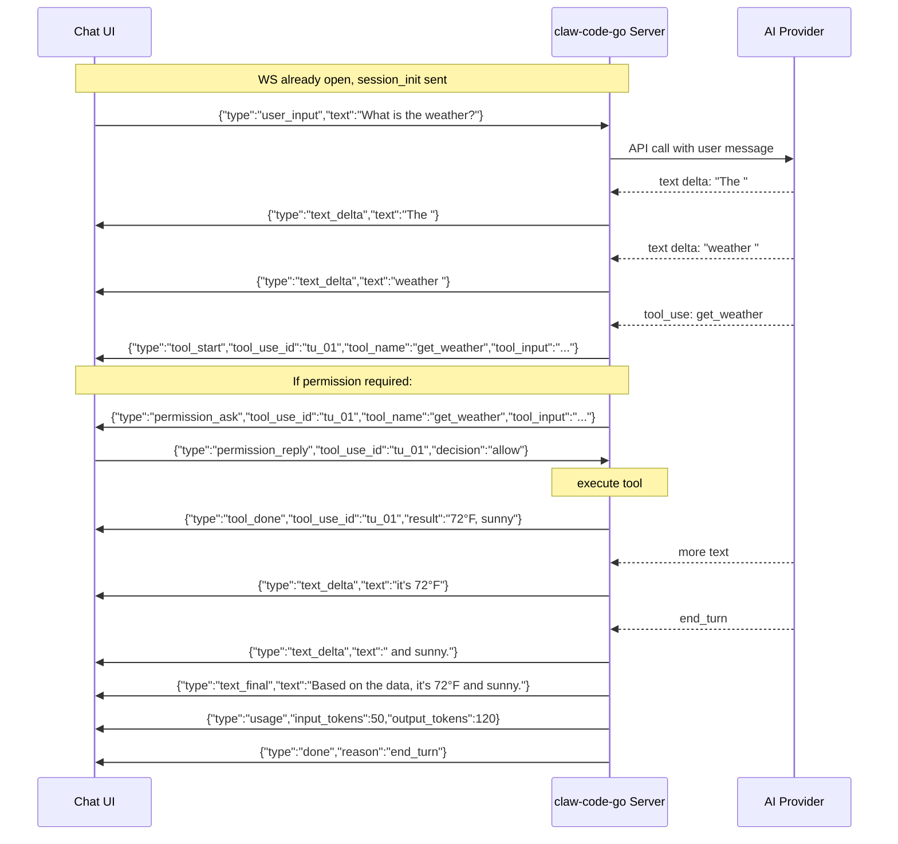

# Web Chat Protocol

The `/api/chat/ws` WebSocket endpoint streams structured JSON events
between the claw-code-go server and the chat UI frontend. This
document describes the wire format, message types, and the lifecycle
of a chat session.

## Architecture

```
Browser (chat UI)  <──WebSocket JSON──>  Server (ConversationLoop)
```

The chat WebSocket runs alongside the existing `/ws` PTY bridge.
Both share the same auth/provider/model resolution, but the wire
format differs:

| Endpoint        | Format      | Purpose
|-----------------|-------------|--------
| `/ws`           | Binary PTY  | Terminal emulator (wterm)
| `/api/chat/ws`  | JSON events | Custom chat UI

## Message format

Every message is a single JSON text frame (not binary). The `type`
field discriminates the message. Fields not relevant to a given type
are omitted (`omitempty`).

### Client → Server

| Type              | Fields                           | Description
|-------------------|----------------------------------|------------
| `user_input`      | `text` (string)                  | User typed a message
| `permission_reply`| `tool_use_id`, `decision`        | Reply to a permission prompt
| `resize`          | `cols`, `rows` (int)             | Terminal viewport resize

**`decision` values**: `"allow"`, `"deny"`, `"allow_always"`

Example:
```json
{"type":"user_input","text":"What is the weather?"}
{"type":"permission_reply","tool_use_id":"tu_01","decision":"allow"}
{"type":"resize","cols":120,"rows":40}
```

### Server → Client

| Type                | Fields                                          | Description
|---------------------|-------------------------------------------------|------------
| `chat_session_init` | `session_id` (string)                           | First message after WS upgrade
| `text_delta`        | `text` (string)                                 | Streaming token
| `text_final`        | `text` (string)                                 | Complete text for a turn
| `tool_start`        | `tool_use_id`, `tool_name`, `tool_input`        | Tool invocation began
| `tool_done`         | `tool_use_id`, `result` (string)                | Tool finished
| `permission_ask`    | `tool_use_id`, `tool_name`, `tool_input`        | Server needs permission
| `ask_user`          | `prompt` (string)                               | Server asks a question
| `usage`             | `input_tokens`, `output_tokens` (int)           | Token usage report
| `done`              | `reason` (string)                               | Turn finished
| `error`             | `code`, `message` (string)                      | Error occurred

**`reason` values**: `"end_turn"`, `"stop"`, `"max_turns"`

Example:
```json
{"type":"chat_session_init","session_id":"sess_abc123"}
{"type":"text_delta","text":"The "}
{"type":"text_delta","text":"weather "}
{"type":"text_delta","text":"is sunny."}
{"type":"text_final","text":"The weather is sunny."}
{"type":"done","reason":"end_turn"}
```

## Session lifecycle

```
1. Client connects to ws://host/api/chat/ws
2. Server sends chat_session_init with session_id
3. Client sends user_input
4. Server runs the conversation turn in a goroutine:
   a. Streams text_delta events as tokens arrive
   b. May send tool_start → (client may send permission_ask reply) → tool_done
   c. May send ask_user (client may reply with user_input)
   d. Sends usage (token counts)
   e. Sends done or error
5. Repeat from step 3 for each turn
6. Client disconnects → server tears down the conversation loop
```

## Sequence diagram (one full turn)



## Error handling

When the server encounters an unrecoverable error, it sends an
`error` event and closes the WebSocket. The client should display the
message and reconnect.

```json
{"type":"error","code":"rate_limit","message":"Too many requests, try again in 30s"}
{"type":"error","code":"provider_down","message":"API provider returned 503"}
{"type":"error","code":"internal","message":"unexpected nil pointer"}
```

## Reconnection guidance

The client should implement exponential backoff reconnection:

- 1s → 2s → 4s → 8s → max 30s
- Use jitter to prevent thundering herd
- On reconnect, resend the last `user_input` only if the server
  hasn't acknowledged it (track via per-message UUID + server ack)
- Show a "Reconnecting..." pill in the UI header during reconnect

## TypeScript types (for reference)

```typescript
type ClientMessage =
  | {type: "user_input", text: string}
  | {type: "permission_reply", tool_use_id: string, decision: "allow" | "deny" | "allow_always"}
  | {type: "resize", cols: number, rows: number};

type ServerMessage =
  | {type: "chat_session_init", session_id: string}
  | {type: "text_delta", text: string}
  | {type: "text_final", text: string}
  | {type: "tool_start", tool_use_id: string, tool_name: string, tool_input: string}
  | {type: "tool_done", tool_use_id: string, result: string}
  | {type: "permission_ask", tool_use_id: string, tool_name: string, tool_input: string}
  | {type: "ask_user", prompt: string}
  | {type: "usage", input_tokens: number, output_tokens: number}
  | {type: "done", reason: "end_turn" | "stop" | "max_turns"}
  | {type: "error", code: string, message: string};
```